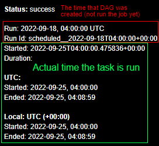

# APACHE Airflow
Apache Airflow is an open-source platform for developing, scheduling, and monitoring batch-oriented workflows. Airflow’s extensible ```Python framework``` enables you to build workflows connecting with virtually any technology. A web interface helps manage the state of your workflows. Airflow is deployable in many ways, varying from a single process on your laptop to a distributed setup to support even the biggest workflows

## Workflows as code
The main characteristic of Airflow workflows is that all workflows are defined in Python code. “Workflows as code” serves several purposes:

- ```Dynamic```: Airflow pipelines are configured as Python code, allowing for dynamic pipeline generation.

- ```Extensible```: The Airflow framework contains operators to connect with numerous technologies. All Airflow components are extensible to easily adjust to your environment.

- ```Flexible```: Workflow parameterization is built-in leveraging the Jinja templating engine

## 1. Cron Expression
A cron expression is a string consisting of six or seven subexpressions (fields) that describe individual details of the schedule. These fields, separated by white space, can contain any of the allowed values with various combinations of the allowed characters for that field.

> ``` [MINUTE] [HOUR] [DAY(MONTH)] [MONTH] [DAY(WEEK)] ```

| Name         | Required | Allowed Values  |
| ------------ | -------- | --------------- |
| Minutes      | Y        | 0-59            |
| Hours        | Y        | 0-23            |
| Day of month | Y        | 1-31            |
| Month        | Y        | 0-11 or JAN-DEC |
| Day of week  | Y        | 1-7 or SUN-SAT  |


example of using cron expression:

| Cron Expression | Explanation                                               |
| --------------- | --------------------------------------------------------- |
| * * * * *       | At every minute.                                          |
| 58 * * * 1      | At minute 58 on Monday.                                   |
| 58 2 * * *      | At 02:58 everyday.                                        |
| 0 15 10 * *     | At 15:00 on day-of-month 10.                              |
| 58 2 5 10 *     | At 02:58 on day-of-month 5 in October.                    |
| 58 5 * 2 3      | At 05:58 on Wednesday in February.                        |
| 58 5 10 2 3     | At 05:58 on day-of-month 10 and on Wednesday in February. |

## 2. ```start_date``` variable explanation

- start_date = The first time that DAG is created (not the first time running the job)
- execution_date = time for running the job/tasks
- schedule_interval = interval for running the DAG, parameter accepts cron or timedelta values

**formula:**
> execution_date = start_date + schedule_interval \
> next_execution_date = last_execution_date + schedule_interval



### **Example:**
start_date = datetime(2019, 10, 13, 15, 50), \
schedule_interval = 0 * * * * or (@hourly)

#### **1. Case A**
>current_time is **before start_date** - **2019-10-13 00:00**, \
then your dags will schedule at 2019-10-13 16:50, and subsequently every hour.\
Please note that it will not run the job at start_date(2019-10-13 15:50), but rather at start_date + schedule_interval

#### **2. Case B**
>current_time is **after start_date** - **2019-10-14 00:00**, \
then your dags will schedule at \
2019-10-13 16:50, \
2019-10-13 17:50, \
2019-10-13 18:50 … \
and subsequently catchup till it reaches 2019-10-13 23:50 \
Then it will wait for the strike of 2019-10-14 00:50 for the next run.
Please not that the catchup can be avoided by setting **catchup=False** in dag properties


## 3. Example of DAG script in Airflow
```python
from airflow import DAG
from airflow.operators.bash import BashOperator

from datetime import datetime
from datetime import timedelta

default_args = {
    'owner': 'DAG_owner',
    'start_date': datetime(2022, 8, 28),
    'email': [
        'email@email.com'
    ],
    'email_on_failure': True,
    'email_on_retry': False,
    'retries': 3,
    'retry_delay': timedelta(minutes=5),
}

with DAG(
        'DAG_name',
        description='Scheduler - description',
        schedule_interval='0 3 * * 1', #cron expression At 03:00 on Monday.
        default_args=default_args,
        tags=['example_dag'],
        catchup=False) as dag_exp:
    t1 = BashOperator(
        task_id='task_1',
        bash_command=
        'cd ~/path_to_job/ && python3 job_1.py',
        dag=dag_exp)

    t2 = BashOperator(
        task_id='task_2',
        bash_command=
        'cd ~/path_to_job/ && python3 job_2.py',
        dag=dag_exp)

    t3 = BashOperator(
        task_id='task_3',
        bash_command=
        'cd ~/path_to_job/ && python3 job_3.py',
        dag=dag_exp)

    t1 >> t2 >> t3
```