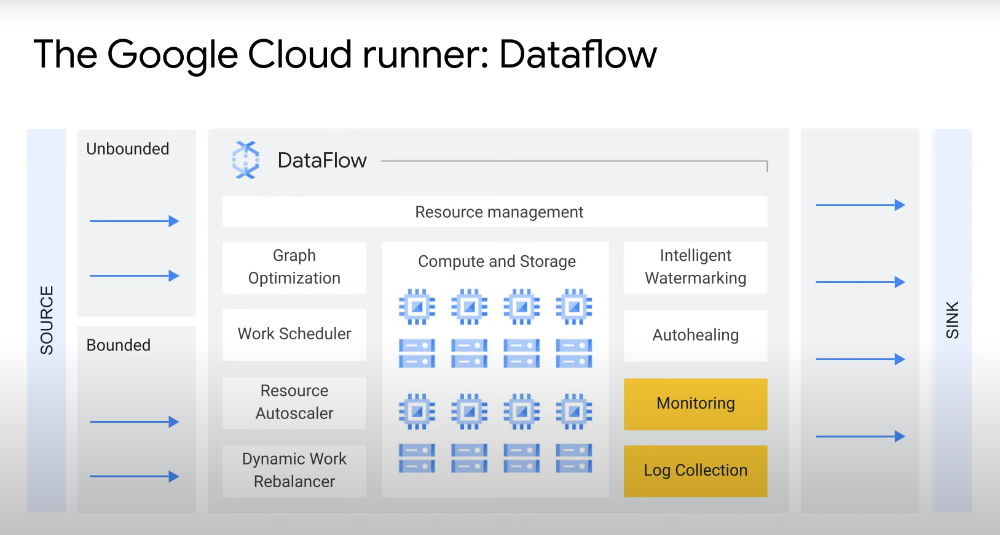
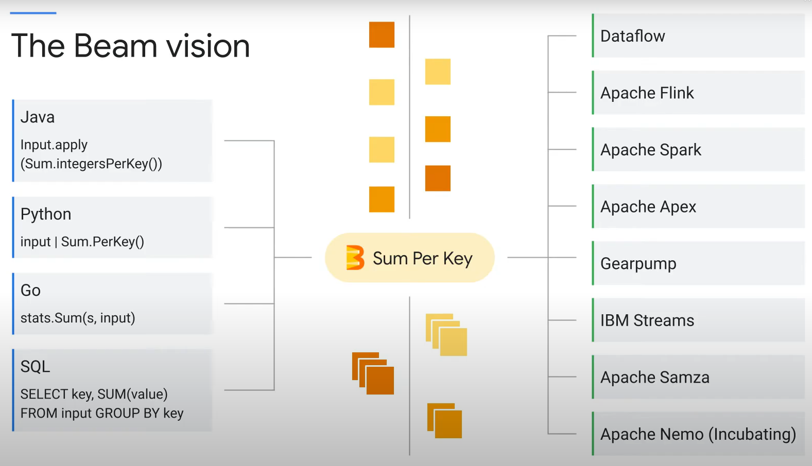

# Apache Beam

## 1. What is Apache Beam?
- Open source unified programming model to define both batch and streaming data-processing pipelines
- Beam SDK sre used to create pipeline in the programming language of your choice
- This pipeline can be run in locally on your computer or on backend services with their own features
- RUNNER is used to execute your PIPELINE on a backend of your choice
- Dataflow is of the runners available in BEAM




Beam provide a comprehensive portability framework for data processing pipelines, that allows you to write your pipeline in specific language with minimal effort.


Every runner works with every language

Dataflow runner v2
1.	More efficient and portable worker architecture
2.	Based on apache beam portability framework
3.	Support for multilanguage pipelines and custom containers



## 2. Apache Beam using Python script in local computer

### 2.1 Get data from database **Postgresql** and store to **parquet** file
```python
import apache_beam as beam
from pysql_beam.sql_io.sql import SQLSource, SQLWriter, ReadFromSQL
from pysql_beam.sql_io.wrapper import MySQLWrapper, PostgresWrapper, SQLDisposition
from apache_beam.options.pipeline_options import PipelineOptions, SetupOptions, GoogleCloudOptions
import pyarrow


class SQLOptions(PipelineOptions):

    @classmethod
    def _add_argparse_args(cls, parser):
        parser.add_value_provider_argument('--host',
                                           dest='host',
                                           default="localhost")
        parser.add_value_provider_argument('--port',
                                           dest='port',
                                           default="5432")
        parser.add_value_provider_argument('--database',
                                           dest='database',
                                           default="postgres")
        parser.add_value_provider_argument(
            '--query',
            dest='query',
            default="SELECT * FROM public.bimc_table where last_name = 'handy';"
        )
        parser.add_value_provider_argument('--username',
                                           dest='username',
                                           default="postgres")
        parser.add_value_provider_argument('--password',
                                           dest='password',
                                           default="[$PASSWORD]")


pipeline_options = PipelineOptions()
options = pipeline_options.view_as(SQLOptions)
pipeline = beam.Pipeline(options=options)

mysql_data = (
    pipeline | ReadFromSQL(host=options.host,
                           port=options.port,
                           username=options.username,
                           password=options.password,
                           database=options.database,
                           query=options.query,
                           wrapper=PostgresWrapper)
    | "write" >> beam.io.WriteToParquet(
        'grocery_same',
        pyarrow.schema([('id', pyarrow.int64()),
                        ('first_name', pyarrow.string())])))

pipeline.run().wait_until_finish()

```


### 2.2 Get data from database **Postgresql** and store to database **Postgresql**
```python
import apache_beam as beam
from pysql_beam.sql_io.sql import SQLSource, SQLWriter, ReadFromSQL
from pysql_beam.sql_io.wrapper import MySQLWrapper, PostgresWrapper, SQLDisposition
from apache_beam.options.pipeline_options import PipelineOptions, SetupOptions, GoogleCloudOptions
import pyarrow


class SQLOptions(PipelineOptions):

    @classmethod
    def _add_argparse_args(cls, parser):
        parser.add_value_provider_argument('--host',
                                           dest='host',
                                           default="localhost")
        parser.add_value_provider_argument('--port',
                                           dest='port',
                                           default="5432")
        parser.add_value_provider_argument('--database',
                                           dest='database',
                                           default="postgres")
        parser.add_value_provider_argument(
            '--query',
            dest='query',
            default="SELECT * FROM public.bimc_table where last_name = 'handy';"
        )
        parser.add_value_provider_argument('--username',
                                           dest='username',
                                           default="postgres")
        parser.add_value_provider_argument('--password',
                                           dest='password',
                                           default="[PASSWORD]")


pipeline_options = PipelineOptions()
options = pipeline_options.view_as(SQLOptions)
pipeline = beam.Pipeline(options=options)

mysql_data = (
    pipeline | ReadFromSQL(host=options.host,
                           port=options.port,
                           username=options.username,
                           password=options.password,
                           database=options.database,
                           query=options.query,
                           wrapper=PostgresWrapper)
            | SQLWriter(host=options.host, port=options.port,
                            username=options.username, password=options.password,
                            database=options.database, table = 'public.bimc_table_out',
                            write_disposition = SQLDisposition.WRITE_TRUNCATE,
                            wrapper=PostgresWrapper
                        )       
                )

pipeline.run().wait_until_finish()

```

### 2.3 Get data from **parquet** file and store to database **Postgresql**
```python
import apache_beam as beam
from pysql_beam.sql_io.sql import SQLSource, SQLWriter, ReadFromSQL
from pysql_beam.sql_io.wrapper import MySQLWrapper, PostgresWrapper, SQLDisposition
from apache_beam.options.pipeline_options import PipelineOptions, SetupOptions, GoogleCloudOptions
import pyarrow

class SQLOptions(PipelineOptions):

    @classmethod
    def _add_argparse_args(cls, parser):
        parser.add_value_provider_argument('--host', dest='host', default="localhost")
        parser.add_value_provider_argument('--port', dest='port', default="5432")
        parser.add_value_provider_argument('--database', dest='database', default="postgres")
        parser.add_value_provider_argument('--query', dest='query', default="SELECT id, first_name FROM public.bimc_table;")
        parser.add_value_provider_argument('--username', dest='username', default="postgres")
        parser.add_value_provider_argument('--password', dest='password', default="[PASSWORD]")

pipeline_options = PipelineOptions()
options = pipeline_options.view_as(SQLOptions)
pipeline = beam.Pipeline(options=options)

mysql_data = ( pipeline | "read" >> beam.io.ReadFromParquet('grocery_same.parquet') 
                        | SQLWriter(host=options.host, port=options.port,
                                    username=options.username, password=options.password,
                                    database=options.database, table = 'public.bimc_table_out',
                                    write_disposition = SQLDisposition.WRITE_TRUNCATE,
                                    wrapper=PostgresWrapper
 
             ))

pipeline.run().wait_until_finish()
```


## 3. Get data from txt file and store again tp txt file using Dataflow GCP
### 3.1 Python script
```python
import apache_beam as beam
from apache_beam.options.pipeline_options import PipelineOptions

class SQLOptions(PipelineOptions):
    @classmethod
    def _add_argparse_args(cls, parser):
        parser.add_argument( '--input', default='gs://siloam-intermediate-storage/backup_spark/temp_handy/de_weekly/improvement_idea/input/grocery.txt')
        parser.add_argument( '--output',default='gs://siloam-intermediate-storage/backup_spark/temp_handy/de_weekly/improvement_idea/output')

pipeline_options = PipelineOptions()
options = pipeline_options.view_as(SQLOptions)
pipeline = beam.Pipeline(options=options)

print(options.input)
print(options.output)
mysql_data = ( pipeline | 'ReadMyFile' >> beam.io.ReadFromText(options.input)
                        | "write" >> beam.io.WriteToText(options.output)
             )

 
pipeline.run().wait_until_finish()
```
### 3.2 Command for running python script in GCP
```powershell
python3 -m \
    gs://siloam-intermediate-storage/backup_spark/temp_handy/de_weekly/improvement_idea/script/apache_beam_2.py \
    --region us-central1 --input gs://siloam-intermediate-storage/backup_spark/temp_handy/de_weekly/improvement_idea/input/grocery.txt \
    --output gs://siloam-intermediate-storage/backup_spark/temp_handy/de_weekly/improvement_idea/output \
    --runner DataflowRunner \
    --project dwh-siloam \
    --temp_location gs://siloam-intermediate-storage/backup_spark/temp_handy/de_weekly/improvement_idea/temp/
```