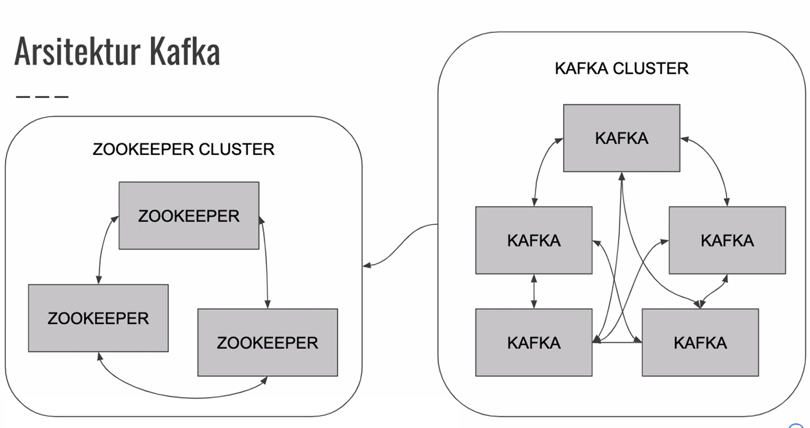

# Apache Kafka (salah satu message broker)
Read and write streams of data like a messaging system 

- Publisher = pengirim data ke topic (kaya table di database)
- Subscriber = topic kirim ke subscriber


## Producer VS Consumer
- Producer = Pihak yang mengirim/mempublish data ke topic/message broker
- Consumer = Pihak yang menerima data dari topic/message broker


- Stream = data yang mengalir terus
- Connector = kalo ada perubahan di database nanti masuk ke topic (stream kayanya)

- Kafka harus berupa cluster (kumpulan dari node/instance kafka (ganjil 1,3,5))



- harus install apache zookeeper kalo jalanin kafka
- zookeeper untuk memanage kafka cluster (master, slave dll)
- kafka diconnect ke zookeeper


## Topic
- Data dari kafka disimpan di **Topic**
- ibaratnya seperti table di database
- data di topic tidak bisa diubah maupun di hapus


di dalam topic terdapat sejumlah partisi. 1 partisi hanya bisa di consume/subscribe 1 aplikasi consumer. jadi pas membuat topic, jumlah partisi harus lebih besar dari jumlah consumer.

## Replication


- P - primary
- R - replikasi
- P1 direplikasi jadi R1
- P2 direplikasi jadi R2
- Replikasi sudah dihandle oleh kafkanya
- Primary dan replikasi tidak boleh berada pada server yang sama supaya tidak hilang data saat server mati.
- default kafka tidak ada replikasi, jadi harus di set up


## Consumer Group


- jadi jumlah partisi paling engga harus sama dengan jumlah app di consumer groupnya


## Retention Policy
- data di topic tidak bisa dihapus, kalau mau hapus topicnya
- Retention = hapus data secara otomatis
- Log retention time = jeda waktu untuk keep datanya (7 hari), bisa di setup
- Log retention byte = berapa max ukuran partisi yang diperbolehkan, bisa disetup. misal retention partisinya 1G, kalau udah 1G bakal dihapus
- Offset retention time =  berapa lama data offset disimpan di kafka, kafka versi lama 1 hari, versi baru 7 hari.


## Kafka Installation


```
pip3 install kafka-python
```


