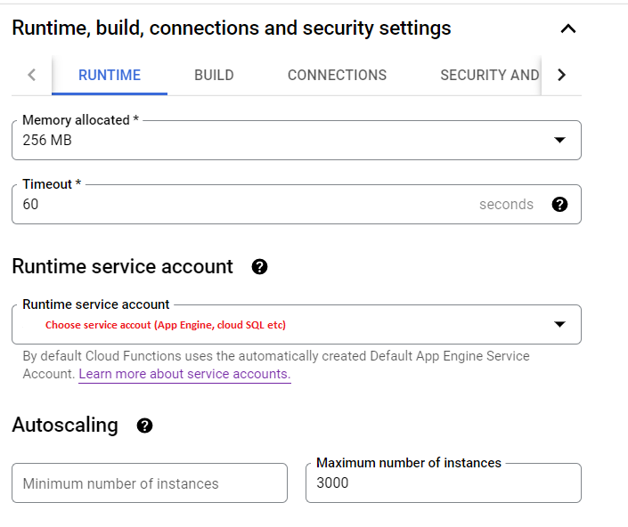
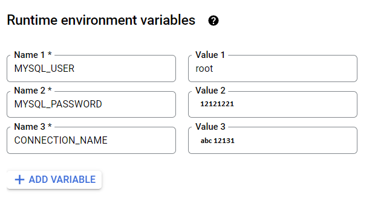

# Google Cloud Platform (GCP) commad
We should run the command on **Terminal** in **GCP**

## 1. How to run spark submit in dataproc-cluster
```powershell
gcloud dataproc jobs submit pyspark gs://[PATH_TO_FILE]/[FILE].py \
--cluster=[DATAPROC_CLUSTER NAME/ID] --region=[REGION EX: asia-southeast2] \
--jars=gs://[PATH_TO_RDBMS_JAR_FILE]/[JARFILE EX:postgresql-42.2.12].jar \
--properties=spark.driver.extraClassPath=[JARFILE EX:postgresql-42.2.12].jar \
--py-files=gs://[PATH_TO_FILE_ADDITIONAL]/[ADDITIONAL_FILE_NAME].py
-- [ARG_1] [ARG_2] [ARG_3] ...
```

## 2. How to create dataproc-workflow_template
```powershell
gcloud dataproc workflow-templates create [workflow_template_name] \
--region=[REGION EX: asia-southeast2] \
--project [PROJECT_NAME] 

gcloud dataproc workflow-templates set-managed-cluster [workflow_template_name] \
--region [REGION EX: asia-southeast2] --subnet jakarta \
--bucket siloam-dataproc \
--zone [ZONE EX: asia-southeast2-a] --master-machine-type n1-standard-1 \
--master-boot-disk-size 250 --num-workers 2 --worker-machine-type n1-standard-1 \
--worker-boot-disk-size 250 --image-version 1.5-ubuntu18 \
--properties dataproc:dataproc.conscrypt.provider.enable=false \
--properties dataproc:dataproc.logging.stackdriver.job.driver.enable=true \
--properties dataproc:jobs.file-backed-output.enable=true \
--properties dataproc:dataproc.logging.stackdriver.job.yarn.container.enable=true \
--initialization-actions 'gs://[PATH_TO_SH_FILE]/[SH_FILE_FOR_INSTALLING_LIBRARY].sh' \
--project [PROJECT_NAME] \
--cluster-name=[cluster_name]


gcloud dataproc workflow-templates add-job pyspark gs://[PATH_TO_FILE]/[FILE]-JOB_1.py \
--region=[REGION EX: asia-southeast2] --step-id=[FILE]-JOB_1 --workflow-template=[workflow_template_name] \
--jars=gs://[PATH_TO_RDBMS_JAR_FILE]/[JARFILE EX:postgresql-42.2.12].jar \
--properties=spark.driver.extraClassPath=[JARFILE EX:postgresql-42.2.12].jar \
--py-files=gs://[PATH_TO_FILE_ADDITIONAL]/[ADDITIONAL_FILE_NAME].py \
--labels sync=[JOB_LABEL_1] --project [PROJECT_NAME]

gcloud dataproc workflow-templates add-job pyspark gs://[PATH_TO_FILE]/[FILE]-JOB_2.py \
--region=[REGION EX: asia-southeast2] --step-id=[FILE]-JOB_2 --start-after=[FILE]-JOB_1 \
--workflow-template=[workflow_template_name] \
--jars=gs://[PATH_TO_RDBMS_JAR_FILE]/[JARFILE EX:postgresql-42.2.12].jar \
--properties=spark.driver.extraClassPath=[JARFILE EX:postgresql-42.2.12].jar \
--py-files=gs://[PATH_TO_FILE_ADDITIONAL]/[ADDITIONAL_FILE_NAME].py \
--labels sync=[JOB_LABEL_2] --project [PROJECT_NAME]

gcloud dataproc workflow-templates add-job pyspark gs://[PATH_TO_FILE]/[FILE]-JOB_3.py \
--region=[REGION EX: asia-southeast2] --step-id=[FILE]-JOB_3 --start-after=[FILE]-JOB_2 \
--workflow-template=[workflow_template_name] \
--jars=gs://[PATH_TO_RDBMS_JAR_FILE]/[JARFILE EX:postgresql-42.2.12].jar \
--properties=spark.driver.extraClassPath=[JARFILE EX:postgresql-42.2.12].jar \
--py-files=gs://[PATH_TO_FILE_ADDITIONAL]/[ADDITIONAL_FILE_NAME].py \
--labels sync=[JOB_LABEL_3] --project [PROJECT_NAME]
``` 


## 3. How to load parquet data to BigQuery
```powershell
!bq load --replace=[true/false] \
--source_format=PARQUET \
--time_partitioning_type=DAY \
--time_partitioning_field=[PARTITION_COLUMN/FIELD] \
[DATASET].[TABLE] \
gs://[PATH_TO_PARQUET]/[PARQUET_FILE_NAME].parquet
``` 

## 4. How to copy a table in BigQuery
```powershell
bq --location=asia-southeast2 cp \
-a -f -n \
[PROJECT_NAME]:[DATASET_SOURCE].[TABLE_SOURCE] \
[PROJECT_NAME]:[DATASET_DESTINATION].[TABLE_DESTINATION]
``` 

## 5. Create Google Cloud Function (GCF)
### 5.1. Determine the function name


### 5.2. Choose "Allow unauthenticated Invocations" for allowing triggering tthe url from everwhere


### 5.3. Choose the "runtime service account", make sure the service account can access the service (like App Engine, Cloud SQL, Compute Enginer etc)


### 5.4. Create environment variables (optional)

